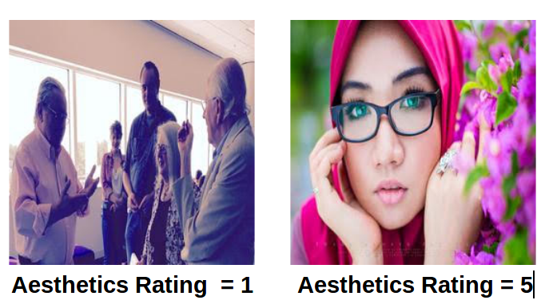

# Predicting Photography Aesthetics with CNNs



### Dataset and Model
First download **dataset** from [**here**](https://drive.google.com/file/d/1iFzhGZwYpnDVpPtJ3XBLGj94NK3NIDNV/view?usp=sharing) and **models** from [**here**](https://drive.google.com/file/d/1zGuc2CGvAARdacGebHv56cYDQuwg_3hw/view?usp=sharing) and place it as shown in below directory structure.

Dataset source: [AADB Datset](https://github.com/aimerykong/deepImageAestheticsAnalysis)

### Code Structure
```bash
  - Predicting-Photography-Aesthetics-with-CNNs
  	| --- accuracy
		| --- accuracy1.txt
		| --- accuracy2.txt
		| --- accuracy3.txt
	| --- model
		| --- model1.h5
		| --- model2.h5
		| --- model3.h5
	| --- dataset
		| --- training
		| --- testing
	| --- scripts
		| --- evaluate.py
		| --- main.py
		| --- model1.py
		| --- model2.py
		| --- model3.py
	| --- test_images
		| --- image1_name.jpg
		| --- image2_name.jpg
		| --- image3_name.jpg
		| --- image4_name.jpg
	| --- testing.txt
	| --- training.txt
	| --- requirements.txt
```

### Installation

First, clone the repository

Next, install the required python3 packages: 
```bash
pip3 install -r requirements.txt
```

Now to classify any new images put all your image inside folder named **test_images** and run below code:-
```bash
python3 scripts/main.py
```
It will give output like this:-

```bash
image1_name 	 3
image2_name 	 2
image3_name 	 2
image4_name 	 5
```
From above output we can see that image1_name has been given 1 star(Poor) and image4_name has been given 5 star(excellent)

To evaluate our CNN models run:-
```bash
python3 scripts/evaluate.py
```
This will read all three models saved in model named folder and output something like this:-
```bash
Reading Model 1
Evaluating Mdel 1
800/800 [==============================] - 6s 8ms/step
Test loss for Model 1: 1.76433014154
Test accuracy for Model 1: 0.35
############################################
Reading Model 2
Evaluating Model 2
800/800 [==============================] - 8s 10ms/step
Test loss for Model 2: 1.43449003458
Test accuracy for Model 2: 0.36375
############################################
Reading Model 3
Evaluating Mdel 3
800/800 [==============================] - 4s 5ms/step
Test loss for Model 3: 1.43597866058
Test accuracy for Model 3: 0.41375
############################################ 
```

To build all three models again run(Already done, not required as this will take more than 8 hours):-
```bash
python3 scripts/model1.py
python3 scripts/model2.py
python3 scripts/model3.py
```

This will generate our three models named
```bash
model1.h5
model2.h5
model3.h5
```

Accuracy folder contains three files each stroing accuracy of each model for ensemble.

